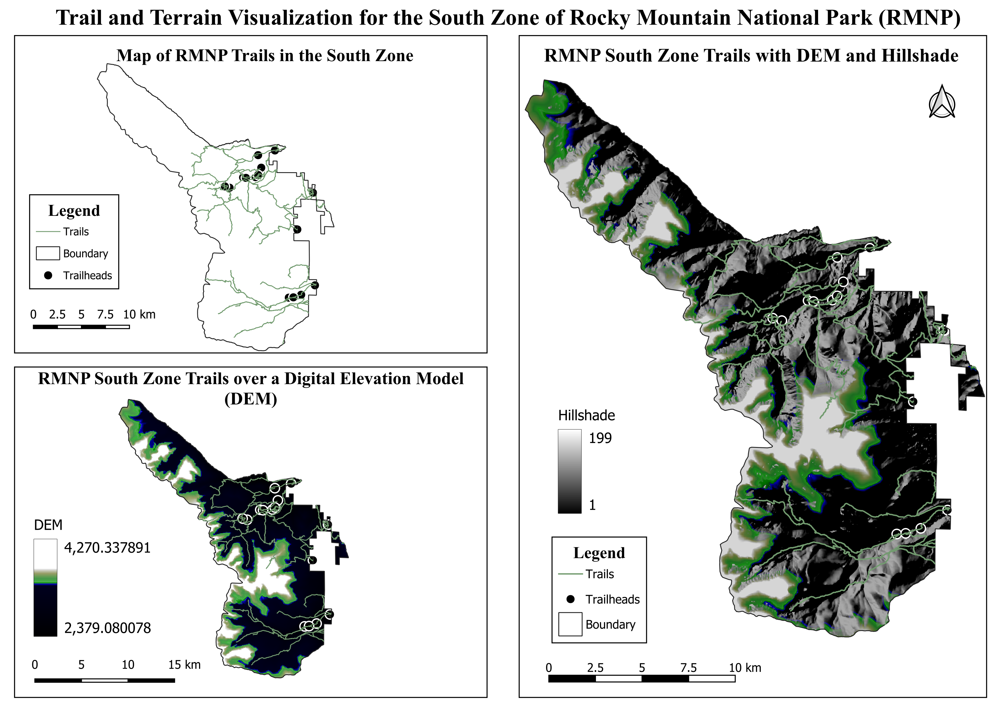
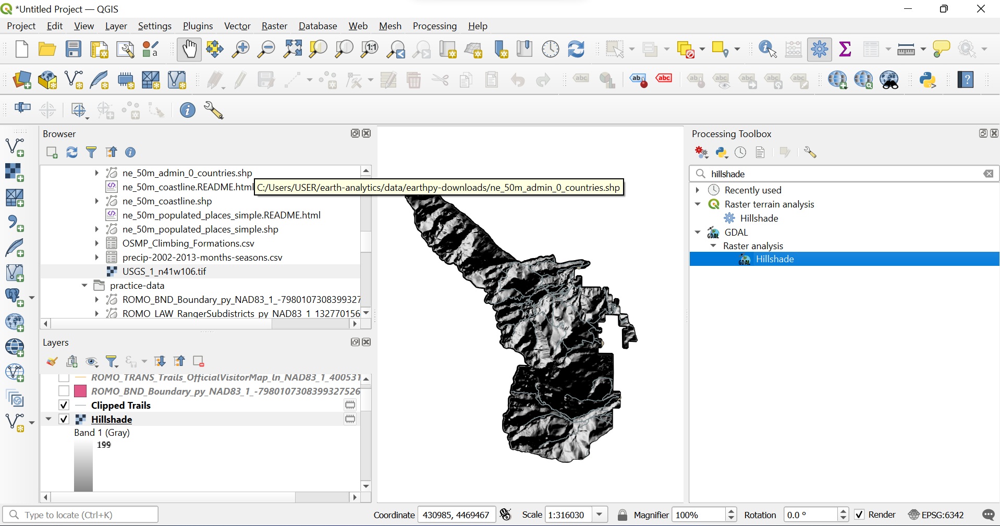
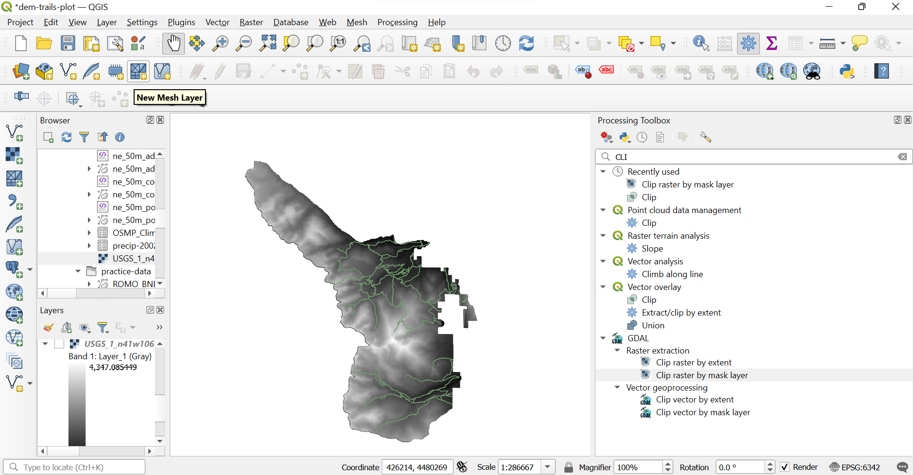
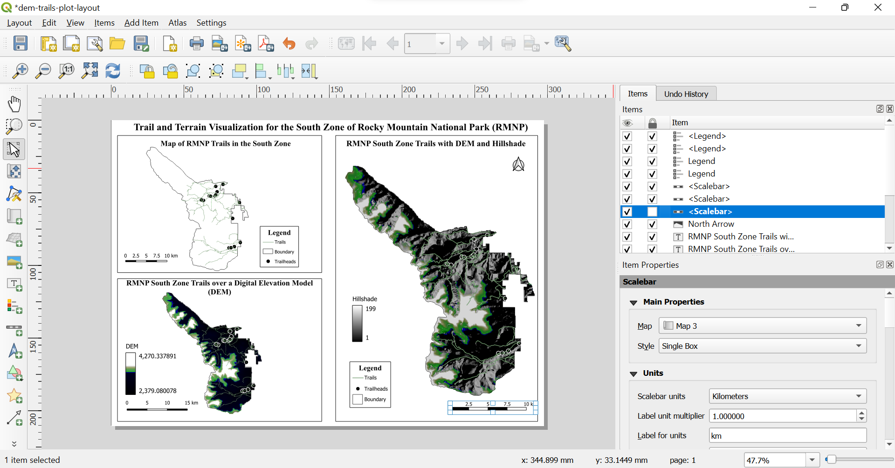

# Trail and Terrain Visualization in Rocky Mountain National Park using QGIS



## Overview

This project demonstrates a complete GIS workflow in **QGIS** using geospatial datasets from **Rocky Mountain National Park (RMNP), Colorado, USA**. The project integrates vector and raster data to visualize hiking trails within the park's South Ranger Zone and explores how **Digital Elevation Models (DEMs)** and hillshade enhance terrain representation in cartographic maps.

Rather than being a standalone exercise, this project represents an important progress in my geospatial learning journey. It was developed as my first desktop GIS project in QGIS, where I recreated and expanded a terrain visualization workflow that I had originally completed in Python from the **Earth Lab – Earth Data Analytics** course textbook. 

The original Python implementation, available in my **Earth Data Science Plotting** repository, focused on generating maps programmatically using GeoPandas, Rasterio, and Matplotlib. In this QGIS version, I translated that workflow into a desktop GIS environment while gaining hands-on experience with interactive spatial data processing, raster analysis, symbology, and cartographic design.

The result is not simply a recreation of the original workflow, but an extension that demonstrates how similar geospatial tasks can be accomplished using professional desktop GIS software.

---

## Project Objectives
- Visualize hiking trails and trailheads within the South Ranger Zone of Rocky Mountain National Park.
- Extract the South Ranger Zone using attribute filtering.
- Clip vector and raster datasets to the study area.
- Visualize terrain using a Digital Elevation Model (DEM).
- Generate hillshade from the DEM to improve terrain perception.
- Design a publication-style multi-panel map layout in QGIS.

---

## Project Workflow

```text
Raw Spatial Data
       │
       ▼
Attribute Filtering
       │
       ▼
South Ranger Zone
       │
       ├────────► Clip Hiking Trails
       │
       ├────────► Clip Trailheads
       │
       ▼
Clip DEM
       │
       ▼
Generate Hillshade
       │
       ▼
Apply Symbology & Styling
       │
       ▼
Design Map Layout
       │
       ▼
Final Cartographic Output
```

---

## GIS Skills Demonstrated
- QGIS Desktop
- Cartographic Design
- Vector Data Processing
- Raster Data Processing
- Attribute Filtering
- Vector Clipping
- Raster Clipping
- DEM Visualization
- Hillshade Generation
- Layer Symbology
- Map Layout Design
- GIS Data Management

---

## Project Development

### 1. Creating the Hillshade
A hillshade raster was generated from the clipped Digital Elevation Model to simulate terrain illumination and improve the visual perception of relief.



---

### 2. Integrating the Trail Network with the DEM
The clipped hiking trails were overlaid on the Digital Elevation Model to provide elevation context and demonstrate the relationship between terrain and the trail network.



---

### 3. Designing the Final Cartographic Layout
The final layout compares three complementary representations of the same study area:

- Trail network, trailheads, and boundary
- Trail network overlaid on the DEM
- Trail network with both DEM and hillshade

This progression illustrates how terrain visualization techniques enhance the interpretation of spatial data.


---

## Final Output
The completed map layout integrates vector and raster datasets into a publication-style cartographic product.



---

## Data Sources
This project uses datasets provided through the **Earth Lab Earth Data Analytics** course.

Datasets include:
- Hiking Trails
- Trailheads
- Ranger Zone Boundaries
- USGS Digital Elevation Model (DEM)

**Study Area:** Rocky Mountain National Park (RMNP), Colorado, USA.

---

## Software
- QGIS
- GDAL
- USGS Digital Elevation Model (DEM)

---

## Results
The final product is a three-panel cartographic layout illustrating the progression from a vector-only map to enhanced terrain visualization using a Digital Elevation Model and hillshade.

The project demonstrates how combining vector and raster datasets provides greater spatial context for interpreting hiking trails within mountainous terrain while reinforcing key GIS concepts in data processing, terrain analysis, and cartographic design.

---

## Future Improvements
- Generate slope and aspect maps.
- Create elevation profiles along hiking trails.
- Perform terrain suitability analysis.
- Build an interactive web map.
- Automate the workflow using PyQGIS.
- Compare the QGIS workflow with the original Python implementation.

---

## Related Project
This project builds upon my earlier Python implementation from the **Earth Lab – Earth Data Analytics** course textbook.

**Python Repository:** [Earth Data Science Plotting Practice](https://github.com/benny019/earth-data-science-plotting/blob/main/4.%20Plotting%20Practice.ipynb)
The two projects demonstrate equivalent geospatial workflows implemented in different environments:

- **Python:** GeoPandas, Rasterio, Matplotlib
- **QGIS:** Desktop GIS, GDAL, Cartographic Layout Tools
